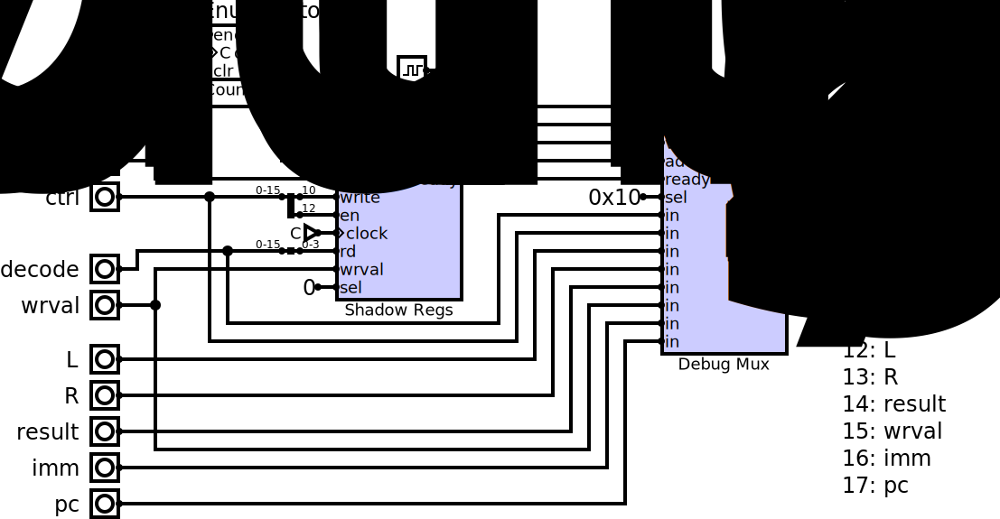
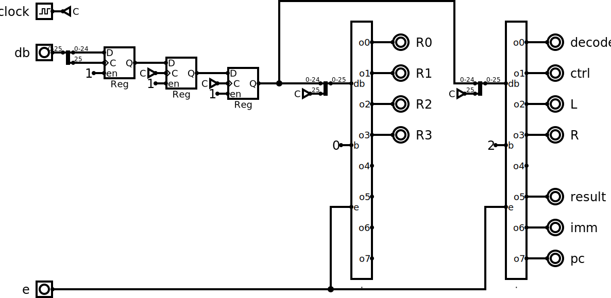
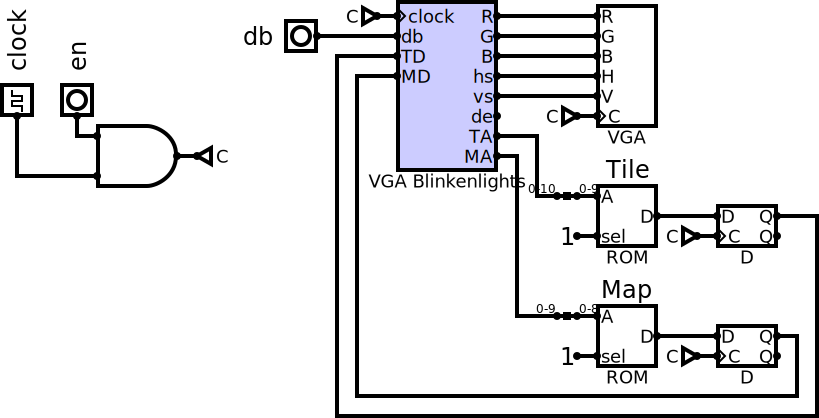

# Debug Bus

## Purpose

In order to avoid top level components growing a lot of inputs and outputs only used for debugging the processor, a debug bus was added.

## Summary

The debug bus essentially packs up to 256 16-bit values into a single 26 bit wire. It does this by enumerating each of the 256 values one by one, looping back to the beginning as soon as the first invalid value is found.

The bus consists of these signals:

- 16 bits of data
- 1 bit indicating data is valid
- 8 bits of "address" indicating which value data belongs to
- 1 bit of clock to avoid passing the clock separately

If a debug signal is less than 16 bits, it is packed into a 16-bit word with other signals in order to reduce the amount of data that needs to go over the debug bus.

## Details

This circuit is the origin of the debug bus. It takes several inputs and bundles them over the bus. There is a counter that enumerates all addresses on the bus which will reset back to zero as soon as an invalid data is seen. Currently this means it loops back to the beginning at address 0x18.

There is also a set of shadow registers that listen to the register write signals and save a copy of what was written to the registers. This avoids the need for an extra read port on the register file.

Additionally there is one or more debug muxes that allow 8 values at a time to be put onto the bus. This is chainable to make layout easier.

Four signals are used internally to generate the debug bus signal:

- data: the data to output
- valid: whether the data is valid
  - note: it's important to not derive this from the ready signal, it must only come from the address
- addr: the address currently being enumerated
- ready: indicates it's safe to move on to the next address in the next cycle. In other words, the receiver is ready to receive.

Currently the ready signal is not really used, and for the most part the valid signal is not used for anything but indicating the end of valid addresses.

## Consuming the Debug Bus

The simplest building block for pulling specific values off of the debug bus is this circuit:

Essentially it waits until the address is a specific value, then saves that value into a register. There's also logic to ensure only a valid value is saved. This circuit is also built to be chainable by passing the db value through.

Multiple values can be efficiently pulled off the bus with a circuit like this:

This circuit is double buffered on an enable signal so, say, if it was used in a video display circuit, it can only update on the vertical blank signal.

This can be combined with some registers to pull the debug bus from a slower clock domain to a faster one with a circuit like this:

## Results

The debug bus greatly reduced the noise from tons of inputs and outputs running everywhere. It's much easier to transfer across clock domains: either a couple of registers will do, or it could be dumped into a block RAM and pulled back out on the other side.

The VGA Front Panel now looks like this, with only a single pin passing all the debugging information:

In the future this bus could very easily be sent over a serial link to a host computer, in addition to its current use in driving two front panel implementations.
