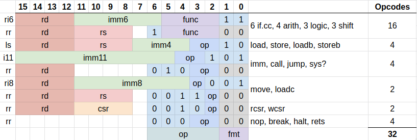
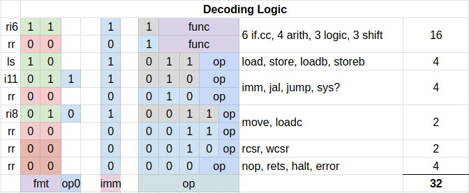

# Instructions

The instruction set of the rj32 processor, so named for the 32 core instructions it implements.

## Table of Contents

- [Instructions](#instructions)
  - [Table of Contents](#table-of-contents)
  - [Instruction Summary](#instruction-summary)
    - [Registers](#registers)
  - [Instruction Encodings](#instruction-encodings)
    - [Instruction Encoding Overview](#instruction-encoding-overview)
    - [Instruction Decoding](#instruction-decoding)
  - [Instruction Details](#instruction-details)
    - [Prefix Instructions and State](#prefix-instructions-and-state)
      - [Imm Prefix](#imm-prefix)
      - [Addc and Subc Prefixes](#addc-and-subc-prefixes)
    - [Skipping](#skipping)
    - [Halting](#halting)
  - [Instruction Listing](#instruction-listing)
    - [System](#system)
      - [imm](#imm)
      - [nop](#nop)
      - [rets](#rets)
      - [error](#error)
      - [halt](#halt)
    - [Moves](#moves)
      - [rcsr](#rcsr)
      - [wcsr](#wcsr)
      - [move](#move)
      - [loadc](#loadc)
    - [Jumps](#jumps)
      - [jump](#jump)
      - [call](#call)
    - [Load Store](#load-store)
      - [load](#load)
      - [store](#store)
      - [loadb](#loadb)
      - [storeb](#storeb)
    - [Arithmetic](#arithmetic)
      - [add](#add)
      - [addc](#addc)
      - [sub](#sub)
      - [subc](#subc)
    - [Logic](#logic)
      - [and](#and)
      - [or](#or)
      - [xor](#xor)
      - [shl](#shl)
      - [shr](#shr)
      - [asr](#asr)
    - [Skips](#skips)
      - [if.eq](#ifeq)
      - [if.ne](#ifne)
      - [if.lt](#iflt)
      - [if.ge](#ifge)
      - [if.ult](#ifult)
      - [if.uge](#ifuge)

TODO:

- [x] First table most useful, draw into rest of doc
- [x] First table too sparse, more info
- [x] Footnotes for unusual instructions
- [ ] Links to more information
- [ ] Anything above the fold should contain links to more info
- [x] Hard to associate bits from encoding table to bits in decoding table
- [x] functional description of what the instructions do
- [ ] encoding/decoding as tables so they are searchable????
- [ ] split into:
  - [ ] short, colourful, hierarchical intro doc
  - [ ] comprehensive cross referenced, single page programmers manual

## Instruction Summary

Some definitions:

- `rd`: destination register and often also left source
- `rs`: right source register
- `csr`: control and status register
- `immediate`: a number provided in the instruction itself
- `imm`: the immediate register or the imm prefix instruction
- `imm4`: unsigned 4 bit immediate
- `imm6`, `imm8`, `imm11`, `imm12`: signed 6, 8, 11 and 12 bit immediates
- `rsval`: right side value
  - from a register: `rsval <- rs` or
  - from an immediate: `rsval <- imm6` or
  - from the immediate register`rsval <- imm[15:4] | imm6[3:0]`
- `mem[]`: data memory
- `memb[]`: byte-wise access to data memory
- `pmem[]`: program memory
- `C`: carry flag, next instruction has carry if set
- `S`: skip flag, next instruction skipped if set
- `K`: kernel mode flag, register set swapped if set

|  op | name              | asm                    |                                                          | description                                      |
| --: | ----------------- | ---------------------- | -------------------------------------------------------- | ------------------------------------------------ |
|   0 | [nop](#nop)       | `nop`                  | `0 <- 0`                                                 | no operation                                     |
|   1 | [rets](#rets)     | `rets`                 | `K <- !K`                                                | return to/from system                            |
|   2 | [error](#error)   | `error`                | `error <- 1`                                             | halt with error <sup>[1](#fnhalt)</sup>          |
|   3 | [halt](#halt)     | `halt`                 | `halt <- 1`                                              | halt without error <sup>[1](#fnhalt)</sup>       |
|   4 | [rcsr](#rcsr)     | `rcsr rd, csr`         | `rd <- csr`                                              | read csr                                         |
|   5 | [wcsr](#wcsr)     | `wcsr csr, rd`         | `csr <- rd`                                              | write csr                                        |
|   6 | [move](#move)     | `move rd, rs/imm8`     | `rd <- rsval`                                            | move into register                               |
|   7 | [loadc](#loadc)   | `loadc rd, rs/imm8`    | `rd <- pmem[pc+imm8]` <br /> `rd <- pmem[rs]`            | load constant                                    |
|   8 | [jump](#jump)     | `jump rd/imm11`        | `pc <- rd` <br /> `pc <- pc + imm11`                     | set program counter                              |
|   9 | [imm](#imm)       | `imm imm12`            | `imm[11:4] <- imm12`                                     | extend immediate <sup>[1](#fnprefix)</sup>       |
|  10 | [call](#call)     | `call rd/imm12`        | `r0 <- pc; pc <- pc + imm11` <br /> `r0 <- pc; pc <- rd` | jump and save `PC`                               |
|  11 | _reserved_        |                        |                                                          | also `imm` instruction                           |
|  12 | [load](#load)     | `load rd, [rs, imm4]`  | `rd <- mem[rs + imm4*2]`                                 | load word                                        |
|  13 | [store](#store)   | `store [rs,imm4], rd`  | `mem[rs + imm4*2] <- rd`                                 | store word                                       |
|  14 | [loadb](#loadb)   | `loadb rd, [rs, imm4]` | `rd <- memb[rs + imm4] & 0xff`                           | load byte                                        |
|  15 | [storeb](#storeb) | `storeb [rs,imm4], rd` | `memb[rs + imm4] <- rd & 0xff`                           | store byte                                       |
|  16 | [add](#add)       | `add rd, rs/imm6`      | `rd <- rd + rsval + C`                                   | add                                              |
|  17 | [sub](#sub)       | `sub rd, rs/imm6`      | `rd <- rd - rsval - C`                                   | subtract                                         |
|  18 | [addc](#addc)     | `addc rd, rs/imm6`     | `rd <- rd + rsval + C;` <br /> `C <- rd[16]`             | add with carry <sup>[1](#fnprefix)</sup>         |
|  19 | [subc](#subc)     | `subc rd, rs/imm6`     | `rd <- rd - rsval - C;` <br /> `C <- rd[16]`             | subtract with carry <sup>[1](#fnprefix)</sup>    |
|  20 | [xor](#xor)       | `xor rd, rs/imm6`      | `rd <- rd xor rsval`                                     | exclusive or                                     |
|  21 | [and](#and)       | `and rd, rs/imm6`      | `rd <- rd and rsval`                                     | logical and                                      |
|  22 | [or](#or)         | `or rd, rs/imm6`       | `rd <- rd or rsval`                                      | logical or                                       |
|  23 | [shl](#shl)       | `shl rd, rs/imm6`      | `rd <- rd << rsval`                                      | logical shift left                               |
|  24 | [shr](#shr)       | `shr rd, rs/imm6`      | `rd <- rd >> rsval` (unsigned)                           | logical shift right                              |
|  25 | [asr](#asr)       | `asr rd, rs/imm6`      | `rd <- rd >> rsval` (signed)                             | arithmetic shift right                           |
|  26 | [if.eq](#if.eq)   | `if.eq rd, rs/imm6`    | `S <- !(rd == rsval)`                                    | if equal <sup>[3](#fnskip)</sup>                 |
|  27 | [if.ne](#if.ne)   | `if.ne rd, rs/imm6`    | `S <- !(rd != rsval)`                                    | if not equal <sup>[3](#fnskip)</sup>             |
|  28 | [if.lt](#if.lt)   | `if.lt rd, rs/imm6`    | `S <- !(rd < rsval)` (signed)                            | if less than <sup>[3](#fnskip)</sup>             |
|  29 | [if.ge](#if.ge)   | `if.ge rd, rs/imm6`    | `S <- !(rd >= rsval)` (signed)                           | if greater or equal <sup>[3](#fnskip)</sup>      |
|  30 | [if.ult](#if.ult) | `if.ult rd, rs/imm6`   | `S <- !(rd < rsval)` (unsigned)                          | if unsigned less than <sup>[3](#fnskip)</sup>    |
|  31 | [if.uge](#if.uge) | `if.uge rd, rs/imm6`   | `S <- !(rd >= rsval)` (unsigned)                         | if unsigned greater than <sup>[3](#fnskip)</sup> |

- <a name="fnhalt">[1]</a>: [halt instruction](#halting)
- <a name="fnprefix">[2]</a>: [prefix instruction](#prefix-instructions-and-state)
- <a name="fnskip">[3]</a>: [skip instruction](#skipping)

There are also the following pseudoinstructions:

| asm              | implementation          | description               |
| ---------------- | ----------------------- | ------------------------- |
| `return`         | `jump r0`               | return from function      |
| `sxt rd`         | `shl rd, 8; asr rd, 8`  | sign extend byte          |
| `zxt rd`         | `shl rd, 8; shr rd, 8`  | zero extend byte          |
| `not rd`         | `xor rd, -1`            | 2's complement            |
| `neg rd`         | `xor rd, -1; add rd, 1` | negate                    |
| `if.gt rd, rs`   | `if.lt rs, rd`          | if greater than           |
| `if.gt rd, imm`  | `if.ge rd, imm+1`       | if greater than           |
| `if.le rd, rs`   | `if.ge rs, rd`          | if less or equal          |
| `if.le rd, imm`  | `if.lt rd, imm-1`       | if less or equal          |
| `if.ugt rd, rs`  | `if.ult rs, rd`         | if unsigned greater than  |
| `if.ugt rd, imm` | `if.uge rs, imm+1`      | if unsigned greater than  |
| `if.ule rd, rs`  | `if.ugt rs, rd`         | if unsigned less or equal |
| `if.ule rd, imm` | `if.ult rs, imm-1`      | if unsigned greater than  |

### Registers

There are 16 registers, only r0 is hard coded with a special function, the other registers can be used in any way. Their calling convention purpose is denoted.

| reg   | alias | conventional usage       |
| ----- | ----- | ------------------------ |
| `r0`  | `ra`  | return address           |
| `r1`  | `a0`  | return value / 1st arg   |
| `r2`  | `a1`  | second function argument |
| `r3`  | `s0`  | callee saved reg         |
| `r4`  | `s1`  | callee saved reg         |
| `r5`  | `s2`  | callee saved reg         |
| `r6`  | `s3`  | callee saved reg         |
| `r7`  | `s4`  | callee saved reg         |
| `r8`  | `t0`  | caller saved temp reg    |
| `r9`  | `t1`  | caller saved temp reg    |
| `r10` | `t2`  | caller saved temp reg    |
| `r11` | `t3`  | caller saved temp reg    |
| `r12` | `t4`  | caller saved temp reg    |
| `r13` | `t5`  | caller saved temp reg    |
| `r14` | `bp`  | data base pointer        |
| `r15` | `sp`  | stack pointer            |

Callee saved registers should be saved to the stack if used in a function.

Caller saved registers are expected to be clobbered in a function call, so if they are used, they are saved in the stack before a function is called.

The first two function arguments are provided in a0 and a1, and the return value is provided in a1. If there are more arguments than two or an argument doesn't fit in 16 bits, they are provided on the stack.

In kernel mode, there is an alternate set of registers including the PC that is used. Which set is in use is governed by the `K` flag.

## Instruction Encodings

### Instruction Encoding Overview



Bits 0-1 are a 2 bit format (`fmt`) code
Bits 2-6 are the `op` code field
Bit 7 on many instructions is reserved for future expansion
The `func` code is the ALU function, which is part of the opcode.

Depending on the `fmt` code, the opcode is constructed from different patterns of bits denoted in the decoding logic section. There are 32 opcodes.

### Instruction Decoding

This diagram shows the opcodes for each instruction format. All instructions have both an immediate form and a register-register form, but the immediate form does not contain a complete opcode field to make room for the immediate bits. Therefore, the decode circuitry needs to modify the opcode for those formats to be the same as the register-register form of the instruction. The modified bits are shown in grey in the diagram below. The non-grey bits can come from the instruction itself.



On the left is the various formats, then the `fmt` code for each instruction class, then (optionally) the zeroth bit of op if it's required, then whether the instruction has an immediate. Then you get the 5 opcode bits.

## Instruction Details

### Prefix Instructions and State

There are a few prefix instructions (`imm`, `addc` and `subc`) that carry state over into the next instruction.

If an interrupt would happen between these instructions and the ones they modify, state would be lost. To avoid that, interrupts are disabled until the instruction they modify completes and that state is fully transferred.

The state is reset after the instruction modified uses that state to ensure it cannot cause bugs by putting the processor into an unexpected state.

#### Imm Prefix

The `imm` prefix instruction extends the immediate of the next instruction. The 12 bits supplied become the 12 most significant bits of the next instruction, and the modified instruction supplies the remaining 4 least significant bits.

#### Addc and Subc Prefixes

It's useful to be able to be able to add or subtract numbers larger than 16 bits. In order to do that, the carry out of the previous `add` or `sub` needs to be fed into the carry in of the next `add` or `sub`. The `addc` and `subc` instructions are provided to set a carry flag as well as a "use carry" flag that will tell the next instruction to use the provided carry. Otherwise these instructions act the same as `add` and `sub`.

For example:

```asm
  ; add two 64 bit numbers
  addc r1, r5
  addc r2, r6
  addc r3, r7
  add  r4, r8  ; this instruction will use the carry

  add  r9, r10 ; this instruction won't use the carry
```

### Skipping

Instead of conditional branches, there are `if.cc` instructions which will skip the next instruction if the condition is not true. Think of these acting like `if` statements in higher level languages.

- `if.eq` - equal
- `if.ne` - not equal
- `if.lt` - less than
- `if.ge` - greater or equal
- `if.ult` - unsigned less than
- `if.uge` - unsigned greater or equal

There are also psuedoinstructions for the following conditions:

- `if.gt` - greater than
- `if.le` - less or equal
- `if.ugt` - unsigned greater than
- `if.ule` - unsigned less or equal

Any prefix instructions (`imm`, `addc` or `subc`) will be skipped in addition to one regular instruction. During a skip, interrupts are disabled. Each skipped instruction uses one clock cycle (they act like `nop`).

### Halting

`halt` and `error` can be used in test cases to halt successfully or with an error. The processor internally loops when these instructions are hit, raising a signal line.

## Instruction Listing

This is quite incomplete... a few instructions are done as an example. The details may be inaccurate due to the instruction set design not being finished yet.

### System

#### imm

|              | register-register form | immediate form               |
| :----------- | ---------------------- | ---------------------------- |
| **format**   | `xxxx xxxx x010 x100`  | `i12`: `iiii iiii iiii 1101` |
| **asm**      | -                      | `imm imm12`                  |
| **example**  | -                      | `imm 0x1234`                 |
| **symbolic** | acts like nop          | `imm <- imm12[15:4]`         |
| **opcode**   | 9 & 11                 |
| **prefix**   | true                   |
| **modifier** | `imm`                  |

This instruction extends the immediate of the next instruction with the upper 12 bits of the 16 bit value. The lower 4 bits come from the next instruction.

This instruction is automatically inserted by the assembler when necessary. If a skip is active, both the imm instruction and the following instruction will be skipped.

Interrupts are disabled during this instruction since the state of the imm register cannot be saved.

#### nop

|              | register-register form |
| :----------- | ---------------------- |
| **format**   | `xxxx xxxx x000 0000`  |
| **asm**      | `nop`                  |
| **example**  | `nop`                  |
| **symbolic** | `0 <- 0`               |
| **opcode**   | 0                      |
| **prefix**   | false                  |

Does nothing.

#### rets

|              | register-register form |
| :----------- | ---------------------- |
| **format**   | `xxxx xxxx x000 0001`  |
| **asm**      | `rets`                 |
| **example**  | `rets`                 |
| **symbolic** | `K <- !K`              |
| **opcode**   | 1                      |
| **prefix**   | false                  |

Swaps the register set and program counter used from the system (aka kernel) set, to the user set, or vice versa.

Execution resumes at the instruction after `rets` in the program in each mode.

If in user mode, the current instruction can be executed as if it were a `rets` instruction if the interrupt request line is high, interrupts are enabled, and the current instruction is interruptible. When this happens, the `pc` does not increment, so that a `rets` from kernel mode will return to the current instruction that would have been executed had the interrupt not occurred.

#### error

|              | register-register form |
| :----------- | ---------------------- |
| **format**   | `xxxx xxxx x000 0010`  |
| **asm**      | `error`                |
| **example**  | `error`                |
| **symbolic** | `error <- 1`           |
| **opcode**   | 2                      |
| **prefix**   | false                  |

Assert the error line and spin until reset. Useful in unit tests to indicate a failure.

Exits the emulator with an error instead of spinning.

#### halt

|              | register-register form |
| :----------- | ---------------------- |
| **format**   | `xxxx xxxx x000 0011`  |
| **asm**      | `halt`                 |
| **example**  | `halt`                 |
| **symbolic** | `halt <- 1`            |
| **opcode**   | 3                      |
| **prefix**   | false                  |

Assert the halt line and spin until reset. Useful in unit tests to indicate a success.

Exits the emulator without an error instead of spinning.

### Moves

#### rcsr

|              | register-register form |
| :----------- | ---------------------- |
| **format**   | `xxxx xxxx x001 0000`  |
| **asm**      | `rcsr rd, csr`         |
| **example**  | `rcsr rd, status`      |
| **symbolic** | `rd <- csr`            |
| **opcode**   | 4                      |
| **prefix**   | false                  |

This instruction is not yet implemented and the design will very likely change.

Moves a CSR into register `rd`. There are up to 16 CSRs and they control things like memory pages/banks, interrupts, and allow reading/writing of the registers from user mode while in system/kernel mode in order to perform a context switch.

#### wcsr

|              | register-register form |
| :----------- | ---------------------- |
| **format**   | `xxxx xxxx x001 0100`  |
| **asm**      | `wcsr csr, rd`         |
| **example**  | `wcsr status, rd`      |
| **symbolic** | `csr <- rd`            |
| **opcode**   | 5                      |
| **prefix**   | false                  |

This instruction is not yet implemented and the design will very likely change.

Moves a register `rd` into a CSR. There are up to 16 CSRs and they control things like memory pages/banks, interrupts, and allow reading/writing of the registers from user mode while in system/kernel mode in order to perform a context switch.

#### move

|              | register-register form | immediate form              |
| :----------- | ---------------------- | --------------------------- |
| **format**   | `dddd ssss x001 1000`  | `i8`: `dddd iiii iiii 0001` |
| **asm**      | `move rd, rs`          | `move rd, imm8`             |
| **example**  | `move r5, r1`          | `move r3, 120`              |
| **symbolic** | `rd <- rs`             | `rd <- imm8`                |
| **opcode**   | 6                      |
| **prefix**   | false                  |

Copy a value from an 8 bit signed
immediate or source register `rs` into the destination
register `rd`.

#### loadc

|              | register-register form | immediate form              |
| :----------- | ---------------------- | --------------------------- |
| **format**   | `dddd ssss x001 1100`  | `i8`: `dddd iiii iiii 1001` |
| **asm**      | `loadc rd, rs`         | `loadc rd, imm8`            |
| **example**  |                        |                             |
| **symbolic** |                        |                             |
| **opcode**   | 7                      |
| **prefix**   | false                  |

Unimplemented. Reserved for an instruction that loads a constant from program memory.

Currently hoping to avoid the need for this instruction.

### Jumps

#### jump

|              | register-register form | immediate form               |
| :----------- | ---------------------- | ---------------------------- |
| **format**   | `dddd xxxx x010 0000`  | `i11`: `iiii iiii iii0 0101` |
| **asm**      | `jump rd`              | `jump i11`                   |
| **example**  | `jump r0`              | `jump mylabel`               |
| **symbolic** | `pc <- rd`             | `pc <- pc + imm11`           |
| **opcode**   | 8                      |
| **prefix**   | false                  |

Jumps to either the absolute address given in a register, or increase the current `pc` by the immediate given.

Note: currently the jump to register is on opcode 4. Some rework is required to fix this instruction.

#### call

|              | register-register form | immediate form               |
| :----------- | ---------------------- | ---------------------------- |
| **format**   | `dddd xxxx x010 0000`  | `i11`: `iiii iiii iii0 0101` |
| **asm**      | `call rd`              | `call i11`                   |
| **example**  | `call r0`              | `call mylabel`               |
| **symbolic** | `pc <- rd`             | `pc <- pc + imm11`           |
| **opcode**   | 10                     |
| **prefix**   | false                  |

Jumps to either the absolute address given in a register, or increase the current `pc` by the immediate given. At the same time, it saves the previous value of `pc + 1` in the register `r0` or `ra`.

Note: Currently calling a register does not work, it still adds the contents of the register to the `pc` which it shouldn't do.

### Load Store

#### load

|              | register-register form | immediate form                    |
| :----------- | ---------------------- | --------------------------------- |
| **format**   | `dddd xxxx x010 0000`  | `ls`: `iiii iiii iii0 0101`       |
| **asm**      | `load rd, [rs]`        | `load rd, [rs, imm4]`             |
| **example**  | `load r5, [r9]`        | `load r6, [r15, 9]`               |
| **symbolic** | `rd <- mem[rs & ~1]`   | `rd <- mem[(rs & ~1) + imm4 * 2]` |
| **opcode**   | 12                     |
| **prefix**   | false                  |

A 16-bit word is loaded from memory at the offset provided by the doubled, zero extended immediate plus a base register `rs` and is stored in register `rd`. The least significant bit of `rs` is ignored.

Note: Implementation is incomplete. The immediate is not shifted left, and memory is currently word indexed not byte indexed. So address 0 is word 0 and address 1 is word 1. Therefore the least significant bit is not currently ignored.

#### store

|              | register-register form | immediate form                   |
| :----------- | ---------------------- | -------------------------------- |
| **format**   | `dddd xxxx x010 0000`  | `ls`: `iiii iiii iii0 0101`      |
| **asm**      | `store [rs], rd`       | `store [rs, imm4], rd`           |
| **example**  | `store [r9], r5`       | `store [r15, 9], r6`             |
| **symbolic** | `mem[rs & ~1] <- rd`   | `mem[(rs & ~1) + imm4 * 2] <-rd` |
| **opcode**   | 13                     |
| **prefix**   | false                  |

A 16-bit word is stored in memory at the offset provided by the doubled, zero extended immediate plus a base register `rs` from the register `rd`.The least significant bit of `rs` is ignored.

Note: Implementation is incomplete. The immediate is not shifted left, and memory is currently word indexed not byte indexed. So address 0 is word 0 and address 1 is word 1. Therefore the least significant bit is not currently ignored.

#### loadb

|              | register-register form | immediate form              |
| :----------- | ---------------------- | --------------------------- |
| **format**   | `dddd xxxx x010 0000`  | `ls`: `iiii iiii iii0 0101` |
| **asm**      | `loadb rd, [rs]`       | `loadb rd, [rs, imm4]`      |
| **example**  | `loadb r2, [r6]`       | `loadb r5, [r2, 15]`        |
| **symbolic** | `rd <- memb[rs]`       | `rd <- memb[rs + imm4]`     |
| **opcode**   | 14                     |
| **prefix**   | false                  |

An 8-bit byte is loaded from memory at the absolute address provided by the register `rs` and is stored in register `rd`. The loaded byte is zero extended to 16-bits.

Note: Not implemented yet.

#### storeb

|              | register-register form | immediate form              |
| :----------- | ---------------------- | --------------------------- |
| **format**   | `dddd xxxx x010 0000`  | `ls`: `iiii iiii iii0 0101` |
| **asm**      | `storeb [rs], rd`      | `storeb [rs, imm4], rd`     |
| **example**  | `storeb [r3], r4`      | `storeb [r12, 10], r2`      |
| **symbolic** | `memb[rs] <- rd`      | `memb[rs + imm4] <-rd`      |
| **opcode**   | 15                     |
| **prefix**   | false                  |

An 8-bit byte in the lower byte of register `rd` is stored to memory at the absolute address provided by the register `rs`.

Note: Not implemented yet.

### Arithmetic

    ri6 format:

    |15|14|13|12|11|10| 9| 8| 7| 6| 5| 4| 3| 2| 1| 0|
    |     rd    |       imm6      |     op    | 1  1|

    rr format:

    |15|14|13|12|11|10| 9| 8| 7| 6| 5| 4| 3| 2| 1| 0|
    |     rd    |     rs    | -| 1|     op    | 0  0|

#### add

    add - add immediate
      format:    ri6
      assembler: add rd, imm6
      example:   add r3, 15
      symbolic:  rd <- rd + imm6 + C
      operation:
                 Add a 6 bit signed immediate to the
                 destination register rd. If an addc
                 or subc instruction preceded this
                 one, the carry flag is also added.

    add - add register
      format:    rr
      assembler: add rd, rs
      example:   add r13, r2
      symbolic:  rd <- rd + rs + C
      operation:
                 Add registers `rd` and `rs` and store
                 back into register `rd`. If an addc
                 or subc instruction preceded this
                 one, the carry flag is also added.

#### addc

    addc - add immediate with carry
      format:    ri6
      assembler: add rd, imm6
      example:   add r3, 15
      symbolic:  rd <- rd + imm6 + C; C <- carry
      operation:
                 Add a 6 bit signed immediate to the
                 destination register rd. If an addc
                 or subc instruction preceded this
                 one, the carry flag is also added.
                 The carry flag is set by this
                 instruction. This instruction is not
                 interruptible, and if a skip is in
                 progress, it will also skip the next
                 instruction.

    addc - add register with carry
      format:    rr
      assembler: add rd, rs
      example:   add r13, r2
      symbolic:  rd <- rd + rs + C; C <- carry
      operation:
                 Add registers `rd` and `rs` and store
                 back into register `rd`. If an addc
                 or subc instruction preceded this
                 one, the carry flag is also added.
                 The carry flag is set by this
                 instruction and will be cleared after
                 the next instruction. This instruction
                 is not interruptible, and if a skip is in
                 progress, it will also skip the next
                 instruction.

#### sub

    sub - subtract immediate
      format:    ri6
      assembler: sub rd, imm6
      example:   sub r3, 43
      symbolic:  rd <- rd - imm6 - C
      operation:
                 Subtract a 6 bit signed immediate from the
                 destination register rd. If the previous
                 instruction was an `addc` or `subc` the
                 carry flag will also be subtracted.

    sub - subtract register
      format:    rr
      assembler: sub rd, rs
      example:   sub r1, r5
      symbolic:  rd <- rd - rs - C
      operation:
                 Subtract registers `rd` and `rs` and store
                 back into register `rd`. If the previous
                 instruction was an `addc` or `subc` the
                 carry flag will also be subtracted.

#### subc

    subc - Subtract immediate with carry
      format:    ri6
      assembler: sub rd, imm6
      example:   sub r3, 15
      symbolic:  rd <- rd - imm6 - C; C <- carry
      operation:
                 Subtract a 6 bit signed immediate
                 from the destination register rd.
                 If an addc or subc instruction
                 preceded this one, the carry flag
                 is also used as a borrow flag.
                 The carry flag is set by this
                 instruction and will be cleared after
                 the next instruction. This instruction
                 is not interruptible, and if a skip is in
                 progress, it will also skip the next
                 instruction.

    subc - subtract register with carry
      format:    rr
      assembler: add rd, rs
      example:   add r13, r2
      symbolic:  rd <- rd - rs - C; C <- carry
      operation:
                 Subtract registers `rd` and `rs` and store
                 back into register `rd`. If an addc
                 or subc instruction preceded this
                 one, the carry flag is also subtracted.
                 The carry flag is set by this
                 instruction and will be reset after the
                 next instruction. This instruction is
                 not interruptible, and if a skip is in
                 progress, it will also skip the next
                 instruction.

### Logic

#### and

#### or

#### xor

#### shl

#### shr

#### asr

### Skips

#### if.eq

#### if.ne

#### if.lt

#### if.ge

#### if.ult

#### if.uge
