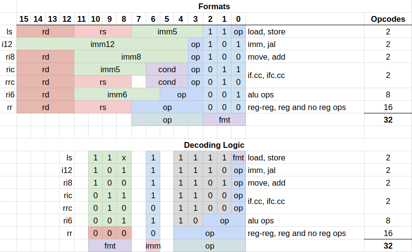
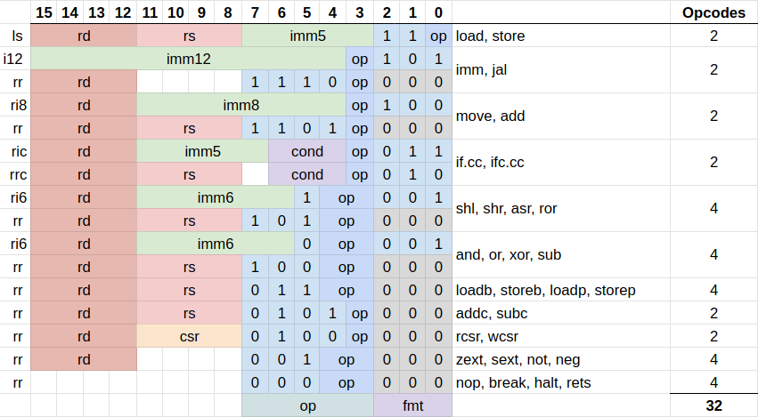
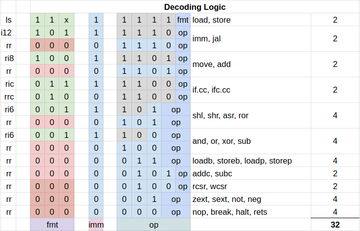

# Instructions

The instruction set of the rj32 processor, so named for the 32 core instructions it implements.

## Instruction Encodings

### Instruction Encoding Overview

Bits 0-2 are a 3 bit format (`fmt`) code
Bits 3-7 are the `op` code field

- `rd`: the left operand register and destination register
- `rs`: the right operand register
- `imm5`-`imm12`: various widths of immediate values
  - `imm5` in the `ls` format is unsigned
- `cond`: the condition code for the `if` skip instructions

Depending on the `fmt` code, the opcode is constructed from different patterns of bits denoted in the decoding logic section. There are 32 opcodes.

### Instruction Encoding Details

In this diagram each instruction is individually listed. In other words it's grouped by instruction rather than by format.

### Instruction Decoding Details

This diagram is the same as above but for the decoding logic instead. It shows the opcode for each instruction.

## Instruction Summary

A summary of the instructions supported, categorized by their instruction format.

### Memory Ops

- `ls`:
  - `load`, `store` - load/store word in data memory
- `rr`:
  - `loadb`, `storeb` - byte access to data memory
  - `loadp`, `storep` - word access to program memory

### ALU Ops

- psuedoinstructions:
  - `not A` = `xor A, -1`
  - `neg A` = `xor A, -1; add A, 1`
- `ri8` & `rr`:
  - `move` - move value from register/immediate to register
  - `add` - add
- `ri6` & `rr`:
  - `sub` - subtract
  - `and`, `or`, `xor` - bitwise ops
  - `shl`, `shr`, `asr`, `ror` - shifts
- `rr` only:
  - `addc`, `subc` - add/subtract with carry from previous instruction
- `r` only:
  - `sext`, `zext` - sign extend, zero extend

### If Skip Ops

These instructions check a condition and skip the next instruction if the condition is false.

- psuedoinstructions:
  - `if.gt A, B`    = `if.lt B, A`
  - `if.gt A, imm`  = `if.ge A, imm+1`
  - `if.hi A, B`    = `if.lo B, A`
  - `if.hi A, imm`  = `if.hs B, imm+1`
  - `if.le A, B`    = `if.ge B, A`
  - `if.le A, imm`  = `if.lt A, imm-1`
  - `if.ls A, B`    = `if.hi B, A`
  - `if.ls A, imm`  = `if.lo B, imm-1`
- `ric` & `rrc`:
  - `if.ne` (Z==0)
  - `if.eq` (Z==1)
  - `if.ge` (N==V)
  - `if.lt` (N!=V)
  - `if.hs` (C==1)
  - `if.lo` (C==0)

### CSRs

- `r` only:
  - `rcsr`, `wcsr` - read and write CSRs (Computer Status Register)

### Branches

  `i12`/`r`:
    - `jal`, `jump`

### Sys Ops

  `i12`:
    - `imm` - prefix to extend next instruction's immediate
  `rr`:
    - `nop` - no operation
    - `rets` - return from/to system
    - `error` - halt with error
    - `halt` - halt with success

### Atomic Ops

This is an idea for implementing atomic read-modify-write
ops in this processor. This is currently not implemented. An alternative is just to disable interrupts.

- `rr`:
  - `ll`, `sc` - locked load, store conditional

## Instruction Details

This is quite incomplete... a few instructions are done as an example. The details may be inacurate due to the instruction set design not being finished yet.

### load / store

    ls format:

    |15|14|13|12|11|10| 9| 8| 7| 6| 5| 4| 3| 2| 1| 0|
    |     rd    |     rs    |     imm5     | 1| 1|op|

    load - load word
      format:    ls
      assembler: load rd, [rs, imm5]
      example:   load r5, [r2, 15]
      symbolic:  rd <- memw[(rs & ~1) + imm5 * 2]
      operation:
                 A 16-bit word is loaded from memory at the
                 offset provided by the doubled, zero
                 extended immediate plus a base register
                 `rs` and is stored in register `rd`. The
                 least significant bit of `rs` is ignored.

    store - store word
      format:    ls
      assembler: store rd, [rs, imm5]
      example:   store r5, [r2, 15]
      symbolic:  memw[(rs & ~1) + imm5 * 2] <- rd
      operation:
                 A 16-bit word is stored in memory at the
                 offset provided by the doubled, zero
                 extended immediate plus a base register `rs`
                 from the register `rd`.The least significant
                 bit of `rs` is ignored.

    rr format:

    |15|14|13|12|11|10| 9| 8| 7| 6| 5| 4| 3| 2| 1| 0|
    |     rd    |     rs    |      op      | 0| 0| 0|

    loadb - load byte
      format:    ls
      assembler: loadb rd, [rs]
      example:   loadb r5, [r2]
      symbolic:  rd <- sext(memb[rs])
      operation:
                 An 8-bit byte is loaded from memory at the
                 absolute address provided by the register
                 `rs` and is stored in register `rd`.

    storeb - store byte
      format:    ls
      assembler: storeb rd, [rs]
      example:   storeb r5, [r2]
      symbolic:  memb[rs] <- rd & 0xff
      operation:
                 An 8-bit byte in the lower byte of register
                 `rd` is stored to memory at the absolute
                 address provided by the register `rs`.

    loadp - load program word
      format:    ls
      assembler: loadp rd, [rs]
      example:   loadp r5, [r2]
      symbolic:  rd <- memp[rs]
      operation:
                 A 16-bit word is loaded from program meory
                 at the absolute address provided by register
                 `rs` and is stored in register `rd`. Note
                 that program memory is word addressed, not
                 byte addressed.

    storeb - store byte
      format:    ls
      assembler: storeb rd, [rs]
      example:   storeb r5, [r2]
      symbolic:  memb[rs] <- rd & 0xff
      operation:
                 An 16-bit word in the register `rd` is
                 stored to program memory at the absolute
                 address provided by the register `rs`. Note
                 that program memory is word addressed, not
                 byte addressed.
