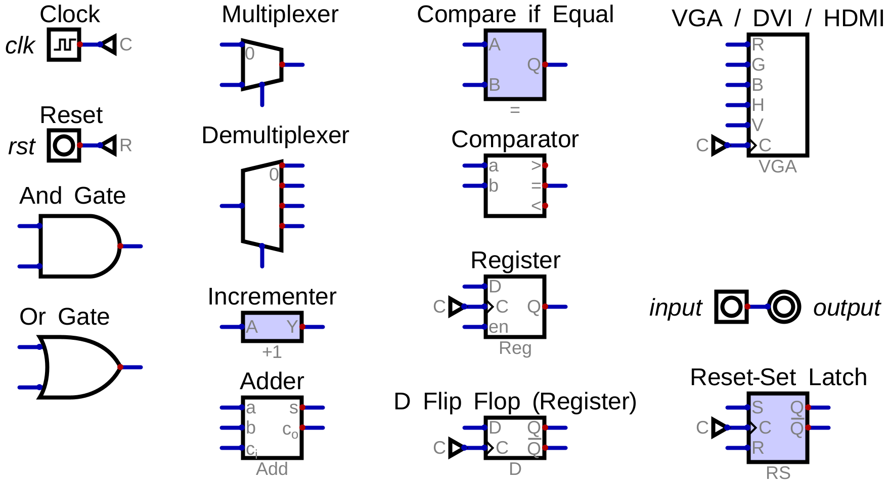

# rj32 VDP - Screen

A retro Video Display Processor (VDP) for hobby CPUs.

Outputting to the screen!

## Goal

- get pixels on the screen
- get verilator and fpga working

## Agenda

- demo
- glossary
- circuit tour
- infrastructure brief

## Glossary

