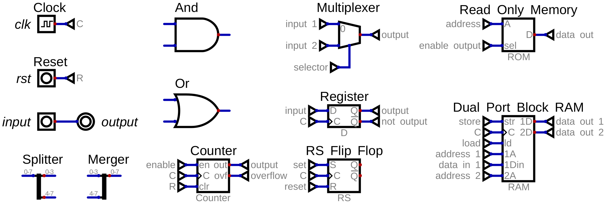
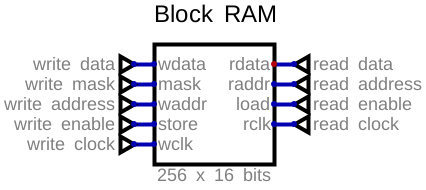

# rj32 VDP - Palette

A retro Video Display Processor (VDP) for hobby CPUs.

**Converting pixels to colours.**

## Goal

- convert 9 bit pixels into 24 bit colours
- use block RAM

## Agenda

- demo
- glossary
- why palette?
- block RAM intro
- building the circuit

## Glossary

## Why Palette?

- 640 x 360 x 24 bits = 5.5 megabits = 691 kilobytes
- 640 x 360 x 9 bits = 2 megabits = 259 kilobytes
- 640 x 360 x 4 bits = 115 kilobytes
- 16 colours is too few, solution in future episodes!
- palette is a 9 bit -> 24 bit lookup table

## Block RAM

- The ice40 FPGA has Block RAM:
  - two ports with their own address and data buses
  - can be written to and read from simultaneously
    - That is, in the same clock cycle
    - CPU can write to it while VDP reads
  - synchronous: data comes one cycle later
  - 256 x 16 bits, or 512 x 8 bits (and other sizes)
  - multiple Block RAMS can be combined into larger ones
  - 32 of these Block RAMs per FPGA
  - can be pre-initialized with data
    - can act like ROM